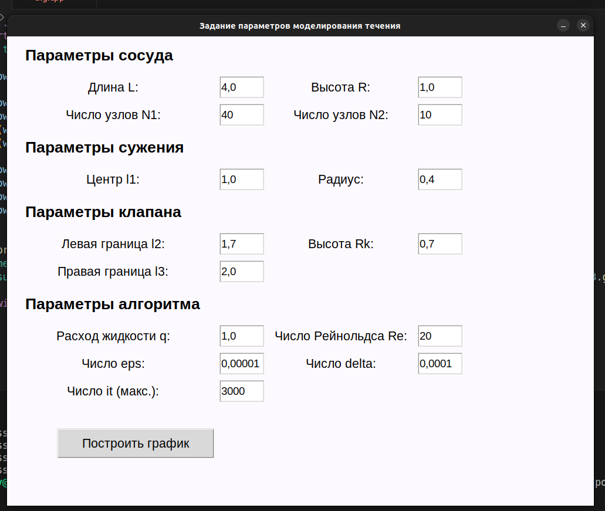
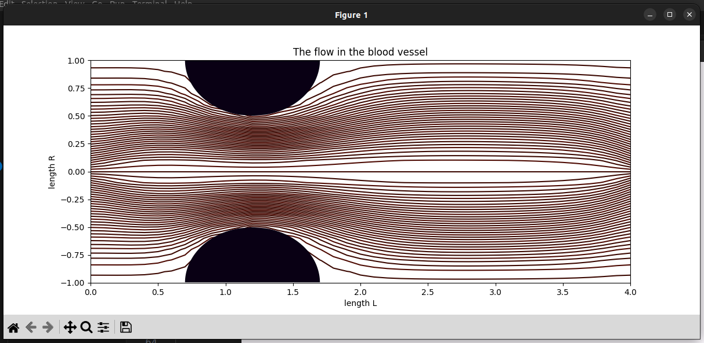

# Коммерческий проект на C++ и Python3 для расчёта протекания крови в сосуде.
## Стек проекта
- Python 3.10
- C++
- Numpy
- Matplotlib
- TKinter
## Описание
- Проект позволяет рассчитать протекание крови в сосуде с припятствием и клапаном, а также без любого из них.
- Используется конечно-разностный метод для численного моделирования.
- Проект имеет 2 версии расчётов: последовательные (alg.cpp) и параллельные (parallel.cpp).
- Интерфейс написан на Python с использованием библиотеки TKinter.
- Графики строются на Python с использованием NumPy.
## Настройка интерфейса
Параметры сосуда (обязательные параметры):
- Длина L - длина сосуда (в 4 раза больше высоты R, кратно числу узлов N1)
- Высота R - высота сосуда (в 4 раза меньше длины L, кратно числу узлов N2)
- Число узлов N1 - количество узлов в дволь сосуда (в 4 раза больше числа узлов N2, кратно высоте R)
- Число узлов N2 - количество узлов поперек сосуда (в 4 раза меньше числа узлов N1, кратно длине L)

Параметры сужения (если задать нулевые значения, то cужение учитываться не будет):
- Центр l1 - центр сужение, расстояние от X=0 (точка располагается на границе при Y=Max)
- Радиус - радиус сужения от центра l1

Параметры клапана (если задать нулевые значения, то клапан учитываться не будет):
- Левая граница l2 - точка левой границы клапана, расстояние от X=0 (меньше правой границы l3)
- Правая граница l3 - точка правой границы клапана, расстояние от X=0 (больше левой границы l2)
- Высота Rk - высота клапана, расстояние от Y=0

Параметры алгоритма (лучше не трогать):
- Расход жидкости q - значение в диапазоне 0...1
- Число eps - число для расчета протекания в фиктивных областях, где жидкости быть не должно, в проекте это сужение и клапан (лучше не трогать) 
- Число Рейнольдса Re - величина, характеризующая отношение инерционных сил к силам вязкого трения в вязких жидкостях и газах (лучше не трогать)
- Число it - максимальное количество итераций для расчетов между узлами в сетке, если погрешность не будет убавляться до числа delta (лучше не трогать)
- Число delta - точность расчётов (лучше не трогать)
## Примеры расчётов



## Запуск проекта
Cоздайте виртуальное окружение, запустите его и установите зависимости:
```bash
python3 -m venv venv
source venv/bin/activate
pip install -r requirements.txt
sudo apt-get install python3-tk
```
Теперь запускаем программу:
```bash
python3 app.py
```
Если необходимо скомпилировать .exe:
```bash
g++ alg.cpp -o alg.exe
g++ parallel.cpp -o parallel.exe
```
